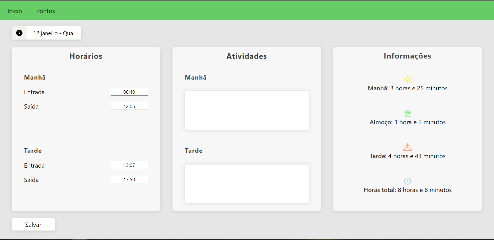
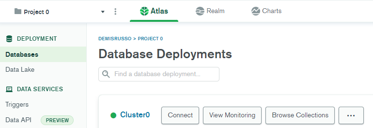

## Controle de Ponto

Controle de horas para saber o tempo de turnos e tempo total.



### MongoDB

Criar uma conexão no [cloud.mongodb.com](cloud.mongodb.com)



Clique em "Connect", "Connect your application" e copiar o link.

Adicionar no root do projeto o arquivo `.env` com uma conexão com o nome `MONGODB_URI="<link>"`

### Iniciar projeto

```bash
yarn // instalar as dependências
yarn dev // Iniciar
```
